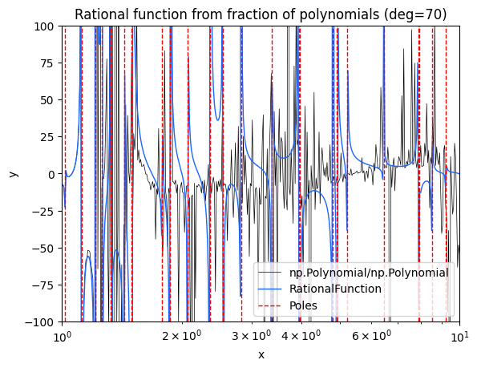

# Why rational functions?

## Introduction

This Python library provides a class for working with rational functions of a single variable. Rational functions are any functions that can be represented as:

$$
R(x) = \frac{P(x)}{Q(x)}
$$

where $P(x)$ and $Q(x)$ are both polynomials. They are a general class of functions with flexible properties that can be useful in a number of situations - for example, [the Cauchy distribution](https://en.wikipedia.org/wiki/Cauchy_distribution) is a rational function, the [transfer function of a dynamical system defined by a linear ODE](https://en.wikipedia.org/wiki/Transfer_function) is a rational function with complex coefficients, and [Padé approximants](https://en.wikipedia.org/wiki/Pad%C3%A9_approximant) are rational function approximations to general functions often better than a simple truncated Taylor polynomial. Rational functions, however, are also more difficult to work with than polynomials, which is what has led to them being significantly less used overall for tasks like approximation and interpolation. Among other things, they are harder to fit, and they suffer from instabilities and singularities due to the zeros of $Q(x)$.

Rational functions, like polynomials, are closed with respect to many operations. The sum, difference, product, ratio, and power of rational functions is always another rational function. The derivative of a rational function is also always another rational function; the integral, however, is not necessarily rational - for a trivial example, consider the integral of the rational function $1/x$, which is $\log(x)$.

## Partial fractions

The ratio of polynomial is the most obvious way of representing a rational function, and it makes most algebraic operations easy. For example, given two rational functions $R_1$ and $R_2$,

$$
R_1(x)+R_2(x) = \frac{P_1(x)}{Q_1(x)} + \frac{P_2(x)}{Q_2(x)} = \frac{P_1(x)Q_2(x)+P_2(x)Q_1(x)}{Q_1(x)Q_2(x)}
$$

However, there is a downside to this representation. When computing with floating point numbers, a few operations can lead both numerator and denominator polynomials to grow in degree very rapidly. This means it's easy for the polynomials to become ill-conditioned and the computation to rapidly lose accuracy.

Fortunately, there are other ways to represent a rational function. A common one is known as the partial fractions decomposition:

$$
R(x) = p(x) + \sum_{i=1}^N \sum_{m=1}^{K_i} \frac{c_i^{(m)}}{(x-r_i)^m}
$$

Here $p(x)$ is the quotient of the polynomial division $P(x)/Q(x)$, which is non-zero only if the degree of $P$ is equal or greater than the degree of $Q$ (in other words, if the rational function is *improper*). The terms $r_i$ are the roots (real or complex) of $Q$, $K_i$ their multiplicities and $c_i^{(m)}$ some constant coefficients (again, real or complex).

This representation is particularly convenient for integration, because when the rational function is represented in this way, each individual term is easily integrable. Notice that often when studying calculus you'll find a distinction between these terms and terms that take the form $1/(w+(x-x_0)^2)$, but that's not important here - those terms really emerge just from the sum of two simpler terms with complex conjugate roots, so we prefer a unified representation for now.

Working in this representation makes a real difference in accuracy compared to the ratio of polynomials, because the individual terms tend to remain at a very low degree, and there is no loss of precision on the poles. Here is an example comparison between the two versions when working with a very ill-conditioned function:

You can find the code that generates this plot in the `/examples` folder of the repository.
